In the context of source separation solutions for virtual reality (VR) applications, several techniques in the spherical harmonic domain (SH) have been proposed in the literature. The performance of such methods is limited under high reverberation conditions and the rendering of the obtained spatial sound is fixed to the recording location only. Recently, novel sound field works in the literature proposed a global representation that enables both the estimation of the direct sound (exterior field) and the reconstruction in locations different from the acquisition ones. In this paper, we propose a signal processing framework based on Multichannel Non-Negative Matrix Factorization (MNMF) in the SH domain that operates directly over the exterior field coefficients enabling the reconstruction of the direct sound field of the separated sources. To evaluate our proposal, we compared with other state-of-the-art source separation approaches using several setups and including different reverberation conditions, showing promising results in terms of SDR metrics.

### Method
<!--   -->

# Listening tests
Audio examples will be available soon.
<!--- Here below we report some audio examples along with the spectrogram of the signals.  

For each example [...].  
We compare the results of the proposed method with the FastMNMF and ILRMA.

--->

<!--- ***************************************** EXAMPLE 1 *************************************************** 
<table style="width: 100%; table-layout: fixed; word-wrap: normal;">
  <!-- SETUP -->
  <tr> 
    <th colspan="4" style="text-align:center;">EXAMPLE 1</th>
  </tr>
  <tr>
    <td>
      Setup  
      SOI=1  
      R=2
    </td>
    <td>
      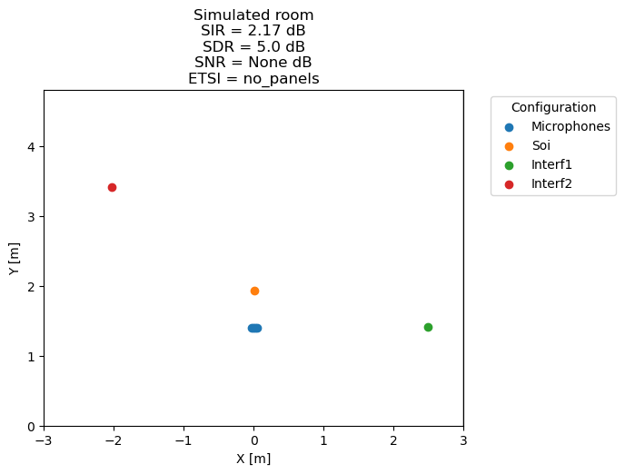
    </td>
    <td>
      
      <audio controls>
        <source src="examples/exs1/ds1/mixture_mic0.wav" type="audio/mpeg">
        Your browser does not support the audio element.
      </audio>
    </td>
    <td>
      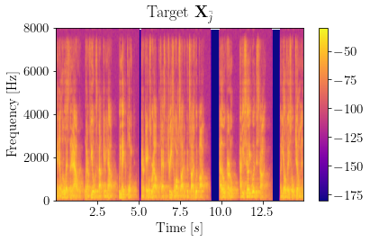
      <audio controls>
        <source src="examples/exs1/ds1/target_beamspace.wav" type="audio/mpeg">
        Your browser does not support the audio element.
      </audio>
    </td>
  </tr>
  <!-- TITLE 
  <tr> 
    <td>
      Dataset
    </td>
    <td>
      Mixture Beamspace
    </td>
    <td>
      NBDF method
    </td>
    <td>
      Proposed method
    </td>
  </tr>
  -->
  <!-- DATASET 1 -->
  <tr> 
    <td>
      I = 4  
      d = 26mm
    </td>
    <td>
      
      <audio controls>
        <source src="examples/exs1/ds1/mixture_beamspace.wav" type="audio/mpeg">
        Your browser does not support the audio element.
      </audio>
      SDR=-3.24dB
    </td>
    <td>
      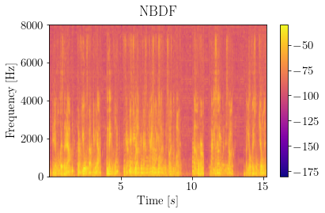
      <audio controls>
        <source src="examples/exs1/ds1/nbdf.wav" type="audio/mpeg">
        Your browser does not support the audio element.
      </audio>
      SDR=-0.86dB
    </td>
    <td>
      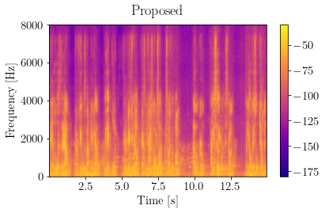
      <audio controls>
        <source src="examples/exs1/ds1/proposed.wav" type="audio/mpeg">
        Your browser does not support the audio element.
      </audio>
      SDR=-0.23dB
    </td>
  </tr>
  <!-- DATASET 2 -->
  <tr> 
    <td>
      I = 3  
      d = 52mm
    </td>
    <td>
      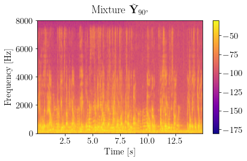
      <audio controls>
        <source src="examples/exs1/ds2/mixture_beamspace.wav" type="audio/mpeg">
        Your browser does not support the audio element.
      </audio>
      SDR=0.74dB
    </td>
    <td>
      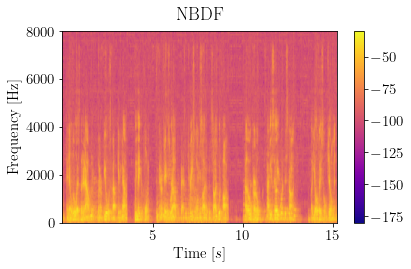
      <audio controls>
        <source src="examples/exs1/ds2/nbdf.wav" type="audio/mpeg">
        Your browser does not support the audio element.
      </audio>
      SDR=3.64dB
    </td>
    <td>
      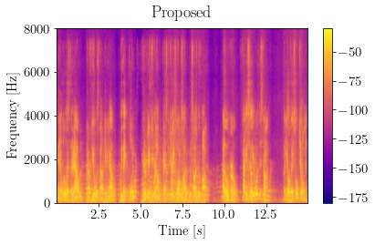
      <audio controls>
        <source src="examples/exs1/ds2/proposed.wav" type="audio/mpeg">
        Your browser does not support the audio element.
      </audio>
      SDR=4.05dB
    </td>
  </tr>
  <!-- DATASET 3 -->
  <tr> 
    <td>
      I = 4  
      d = 52mm
    </td>
    <td>
      
      <audio controls>
        <source src="examples/exs1/ds3/mixture_beamspace.wav" type="audio/mpeg">
        Your browser does not support the audio element.
      </audio>
      SDR=1.08dB
    </td>
    <td>
      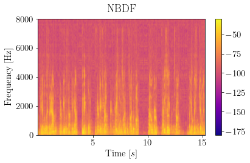
      <audio controls>
        <source src="examples/exs1/ds3/nbdf.wav" type="audio/mpeg">
        Your browser does not support the audio element.
      </audio>
      SDR=0.29dB
    </td>
    <td>
      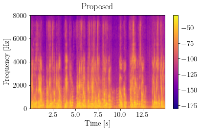
      <audio controls>
        <source src="examples/exs1/ds3/proposed.wav" type="audio/mpeg">
        Your browser does not support the audio element.
      </audio>
      SDR=1.1dB
    </td>
  </tr>
</table> 
--> 
<!-- ***************************************** EXAMPLE 2 *************************************************** -->

<table style="width: 100%; table-layout: fixed; word-wrap: normal;">
  <!-- SETUP -->
  <tr> 
    <th colspan="4" style="text-align:center;">EXAMPLE 2</th>
  </tr>
  <tr>
    <td>
      Setup  
      SOI=1  
      R=3
    </td>
    <td>
      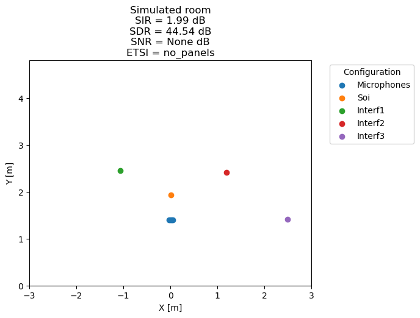
    </td>
    <td>
      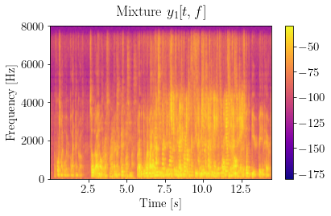
      <audio controls>
        <source src="examples/exs2/ds1/mixture_mic0.wav" type="audio/mpeg">
        Your browser does not support the audio element.
      </audio>
    </td>
    <td>
      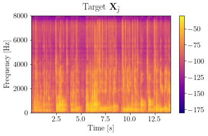
      <audio controls>
        <source src="examples/exs2/ds1/target_beamspace.wav" type="audio/mpeg">
        Your browser does not support the audio element.
      </audio>
    </td>
  </tr>
  <!-- TITLE 
  <tr> 
    <td>
      Dataset
    </td>
    <td>
      Mixture Beamspace
    </td>
    <td>
      NBDF method
    </td>
    <td>
      Proposed method
    </td>
  </tr>
  -->
  <!-- DATASET 1 -->
  <tr> 
    <td>
      I = 4  
      d = 26mm
    </td>
    <td>
      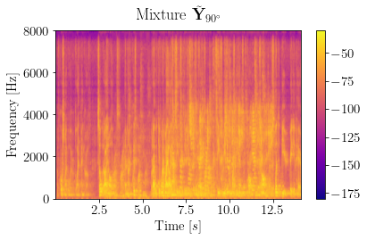
      <audio controls>
        <source src="examples/exs2/ds1/mixture_beamspace.wav" type="audio/mpeg">
        Your browser does not support the audio element.
      </audio>
      SDR=3.64dB
    </td>
    <td>
      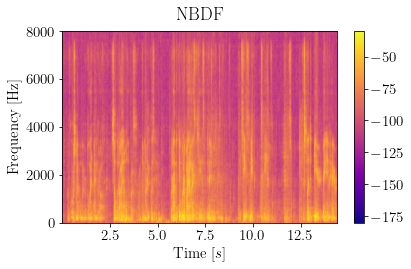
      <audio controls>
        <source src="examples/exs2/ds1/nbdf.wav" type="audio/mpeg">
        Your browser does not support the audio element.
      </audio>
      SDR=0.23dB
    </td>
    <td>
      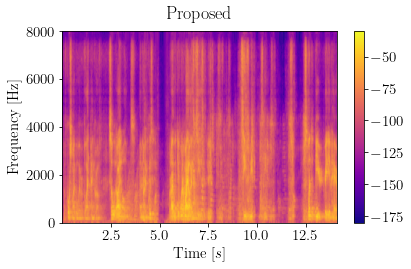
      <audio controls>
        <source src="examples/exs2/ds1/proposed.wav" type="audio/mpeg">
        Your browser does not support the audio element.
      </audio>
      SDR=4.51dB
    </td>
  </tr>
  <!-- DATASET 2 -->
  <tr> 
    <td>
      I = 3  
      d = 52mm
    </td>
    <td>
      
      <audio controls>
        <source src="examples/exs2/ds2/mixture_beamspace.wav" type="audio/mpeg">
        Your browser does not support the audio element.
      </audio>
      SDR=3.77dB
    </td>
    <td>
      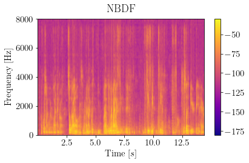
      <audio controls>
        <source src="examples/exs2/ds2/nbdf.wav" type="audio/mpeg">
        Your browser does not support the audio element.
      </audio>
      SDR=2.92dB
    </td>
    <td>
      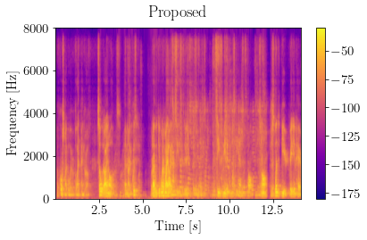
      <audio controls>
        <source src="examples/exs2/ds2/proposed.wav" type="audio/mpeg">
        Your browser does not support the audio element.
      </audio>
      SDR=8.08dB
    </td>
  </tr>
  <!-- DATASET 3 -->
  <tr> 
    <td>
      I = 4  
      d = 52mm
    </td>
    <td>
      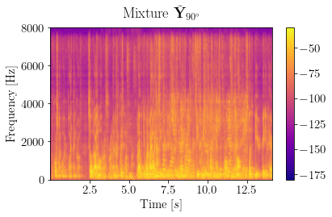
      <audio controls>
        <source src="examples/exs2/ds3/mixture_beamspace.wav" type="audio/mpeg">
        Your browser does not support the audio element.
      </audio>
      SDR=3.55dB
    </td>
    <td>
      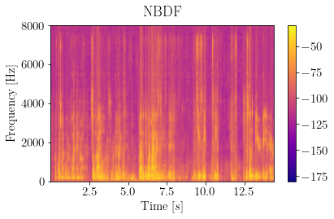
      <audio controls>
        <source src="examples/exs2/ds3/nbdf.wav" type="audio/mpeg">
        Your browser does not support the audio element.
      </audio>
      SDR=1.09dB
    </td>
    <td>
      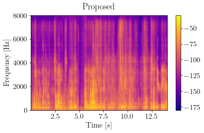
      <audio controls>
        <source src="examples/exs2/ds3/proposed.wav" type="audio/mpeg">
        Your browser does not support the audio element.
      </audio>
      SDR=4.42dB
    </td>
  </tr>
</table>

<!-- ***************************************** EXAMPLE 3 *************************************************** -->

<table style="width: 100%; table-layout: fixed; word-wrap: normal;">
  <!-- SETUP -->
  <tr> 
    <th colspan="4" style="text-align:center;">EXAMPLE 3</th>
  </tr>
  <tr>
    <td>
      Setup  
      SOI=1  
      R=0
    </td>
    <td>
      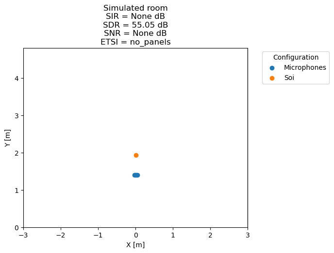
    </td>
    <td>
      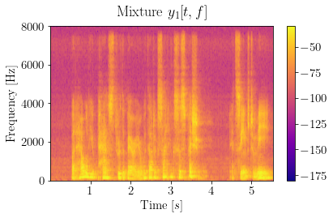
      <audio controls>
        <source src="examples/exs3/ds1/mixture_mic0.wav" type="audio/mpeg">
        Your browser does not support the audio element.
      </audio>
    </td>
    <td>
      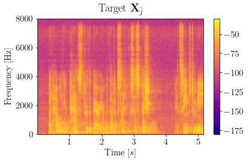
      <audio controls>
        <source src="examples/exs3/ds1/target_beamspace.wav" type="audio/mpeg">
        Your browser does not support the audio element.
      </audio>
    </td>
  </tr>
  <!-- TITLE 
  <tr> 
    <td>
      Dataset
    </td>
    <td>
      Mixture Beamspace
    </td>
    <td>
      NBDF method
    </td>
    <td>
      Proposed method
    </td>
  </tr>
  -->
  <!-- DATASET 1 -->
  <tr> 
    <td>
      I = 4  
      d = 26mm
    </td>
    <td>
      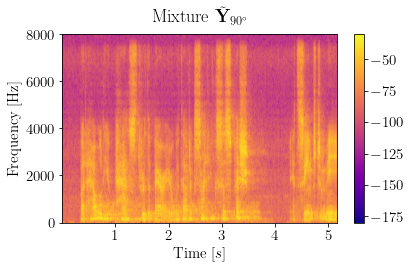
      <audio controls>
        <source src="examples/exs3/ds1/mixture_beamspace.wav" type="audio/mpeg">
        Your browser does not support the audio element.
      </audio>
      R_soi= -
    </td>
    <td>
      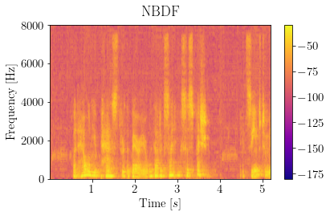
      <audio controls>
        <source src="examples/exs3/ds1/nbdf.wav" type="audio/mpeg">
        Your browser does not support the audio element.
      </audio>
      R_soi=-1.86db
    </td>
    <td>
      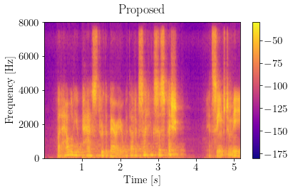
      <audio controls>
        <source src="examples/exs3/ds1/proposed.wav" type="audio/mpeg">
        Your browser does not support the audio element.
      </audio>
      R_soi=-5.53db
    </td>
  </tr>
  <!-- DATASET 2 -->
  <tr> 
    <td>
      I = 3  
      d = 52mm
    </td>
    <td>
      
      <audio controls>
        <source src="examples/exs3/ds2/mixture_beamspace.wav" type="audio/mpeg">
        Your browser does not support the audio element.
      </audio>
      R_soi= -
    </td>
    <td>
      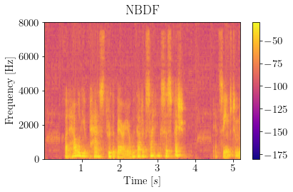
      <audio controls>
        <source src="examples/exs3/ds2/nbdf.wav" type="audio/mpeg">
        Your browser does not support the audio element.
      </audio>
      R_soi=-0.5db
    </td>
    <td>
      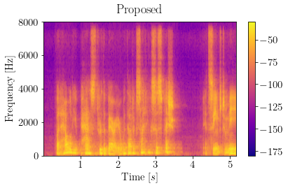
      <audio controls>
        <source src="examples/exs3/ds2/proposed.wav" type="audio/mpeg">
        Your browser does not support the audio element.
      </audio>
      R_soi=-2.48db
    </td>
  </tr>
  <!-- DATASET 3 -->
  <tr> 
    <td>
      I = 4  
      d = 52mm
    </td>
    <td>
      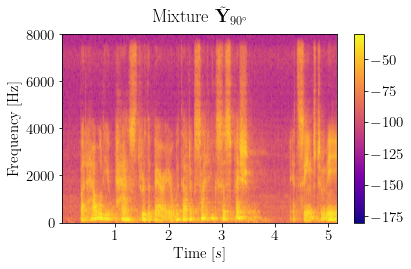
      <audio controls>
        <source src="examples/exs3/ds3/mixture_beamspace.wav" type="audio/mpeg">
        Your browser does not support the audio element.
      </audio>
      R_soi= -
    </td>
    <td>
      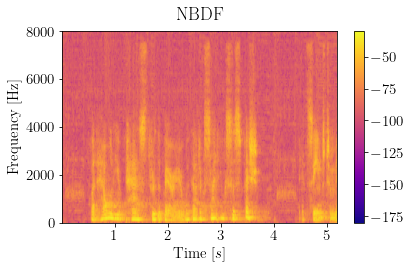
      <audio controls>
        <source src="examples/exs3/ds3/nbdf.wav" type="audio/mpeg">
        Your browser does not support the audio element.
      </audio>
      R_soi=-0.06db
    </td>
    <td>
      
      <audio controls>
        <source src="examples/exs3/ds3/proposed.wav" type="audio/mpeg">
        Your browser does not support the audio element.
      </audio>
      R_soi=-5.54db
    </td>
  </tr>
</table>

<!-- ***************************************** EXAMPLE 4 *************************************************** -->

<table style="width: 100%; table-layout: fixed; word-wrap: normal;">
  <!-- SETUP -->
  <tr> 
    <th colspan="4" style="text-align:center;">EXAMPLE 4</th>
  </tr>
  <tr>
    <td>
      Setup  
      SOI=1  
      R=1
    </td>
    <td>
      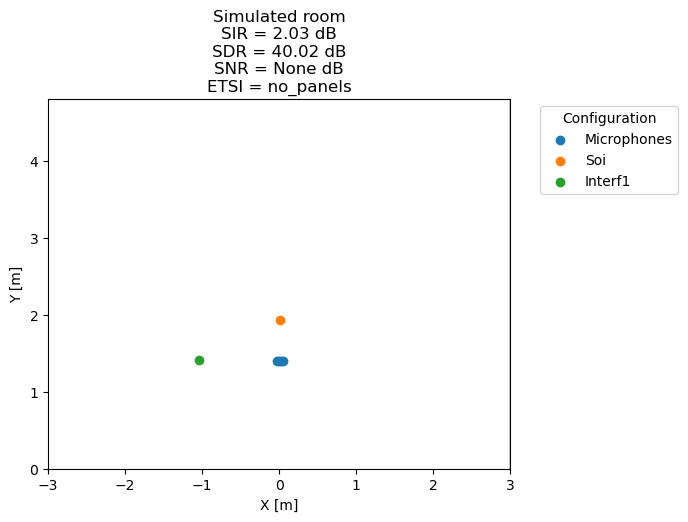
    </td>
    <td>
      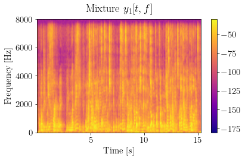
      <audio controls>
        <source src="examples/exs4/ds1/mixture_mic0.wav" type="audio/mpeg">
        Your browser does not support the audio element.
      </audio>
    </td>
    <td>
      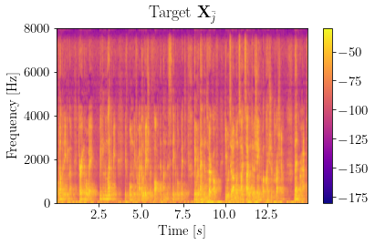
      <audio controls>
        <source src="examples/exs4/ds1/target_beamspace.wav" type="audio/mpeg">
        Your browser does not support the audio element.
      </audio>
    </td>
  </tr>
  <!-- TITLE 
  <tr> 
    <td>
      Dataset
    </td>
    <td>
      Mixture Beamspace
    </td>
    <td>
      NBDF method
    </td>
    <td>
      Proposed method
    </td>
  </tr>
  -->
  <!-- DATASET 1 -->
  <tr> 
    <td>
      I = 4  
      d = 26mm
    </td>
    <td>
      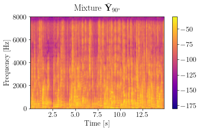
      <audio controls>
        <source src="examples/exs4/ds1/mixture_beamspace.wav" type="audio/mpeg">
        Your browser does not support the audio element.
      </audio>
      SDR=4.87dB
    </td>
    <td>
      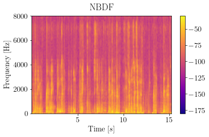
      <audio controls>
        <source src="examples/exs4/ds1/nbdf.wav" type="audio/mpeg">
        Your browser does not support the audio element.
      </audio>
      SDR=1.84dB
    </td>
    <td>
      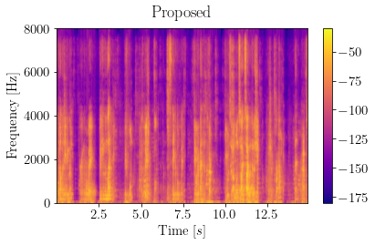
      <audio controls>
        <source src="examples/exs4/ds1/proposed.wav" type="audio/mpeg">
        Your browser does not support the audio element.
      </audio>
      SDR=2.06dB
    </td>
  </tr>
  <!-- DATASET 2 -->
  <tr> 
    <td>
      I = 3  
      d = 52mm
    </td>
    <td>
      
      <audio controls>
        <source src="examples/exs4/ds2/mixture_beamspace.wav" type="audio/mpeg">
        Your browser does not support the audio element.
      </audio>
      SDR=4.58dB
    </td>
    <td>
      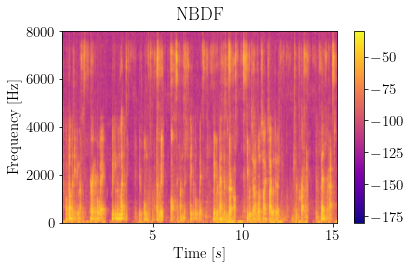
      <audio controls>
        <source src="examples/exs4/ds2/nbdf.wav" type="audio/mpeg">
        Your browser does not support the audio element.
      </audio>
      SDR=5.06dB
    </td>
    <td>
      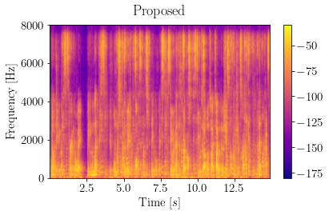
      <audio controls>
        <source src="examples/exs4/ds2/proposed.wav" type="audio/mpeg">
        Your browser does not support the audio element.
      </audio>
      SDR=5.14dB
    </td>
  </tr>
  <!-- DATASET 3 -->
  <tr> 
    <td>
      I = 4  
      d = 52mm
    </td>
    <td>
      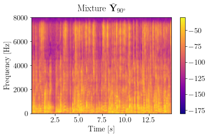
      <audio controls>
        <source src="examples/exs4/ds3/mixture_beamspace.wav" type="audio/mpeg">
        Your browser does not support the audio element.
      </audio>
      SDR=5.05dB
    </td>
    <td>
      
      <audio controls>
        <source src="examples/exs4/ds3/nbdf.wav" type="audio/mpeg">
        Your browser does not support the audio element.
      </audio>
      SDR=1.33dB
    </td>
    <td>
      
      <audio controls>
        <source src="examples/exs4/ds3/proposed.wav" type="audio/mpeg">
        Your browser does not support the audio element.
      </audio>
      SDR=3.87dB
    </td>
  </tr>
</table>

<!-- ***************************************** EXAMPLE 5 *************************************************** -->

<table style="width: 100%; table-layout: fixed; word-wrap: normal;">
  <!-- SETUP -->
  <tr> 
    <th colspan="4" style="text-align:center;">EXAMPLE 5</th>
  </tr>
  <tr>
    <td>
      Setup  
      SOI=0  
      R=4
    </td>
    <td>
      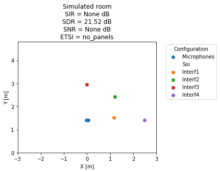
    </td>
    <td>
      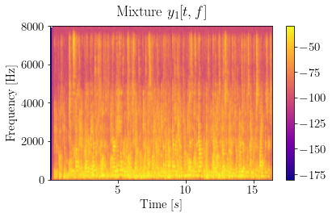
      <audio controls>
        <source src="examples/exs5/ds1/mixture_mic0.wav" type="audio/mpeg">
        Your browser does not support the audio element.
      </audio>
    </td>
    <td>
      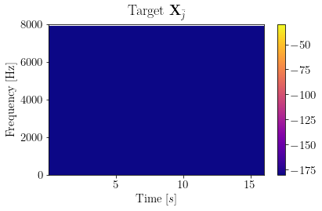
      <audio controls>
        <source src="examples/exs5/ds1/target_beamspace.wav" type="audio/mpeg">
        Your browser does not support the audio element.
      </audio>
    </td>
  </tr>
  <!-- TITLE 
  <tr> 
    <td>
      Dataset
    </td>
    <td>
      Mixture Beamspace
    </td>
    <td>
      NBDF method
    </td>
    <td>
      Proposed method
    </td>
  </tr>
  -->
  <!-- DATASET 1 -->
  <tr> 
    <td>
      I = 4  
      d = 26mm
    </td>
    <td>
      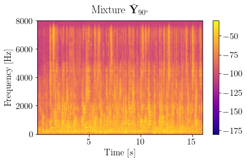
      <audio controls>
        <source src="examples/exs5/ds1/mixture_beamspace.wav" type="audio/mpeg">
        Your browser does not support the audio element.
      </audio>
      R_interf= - 
    </td>
    <td>
      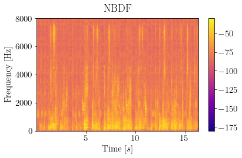
      <audio controls>
        <source src="examples/exs5/ds1/nbdf.wav" type="audio/mpeg">
        Your browser does not support the audio element.
      </audio>
      R_interf=-7.88dB
    </td>
    <td>
      
      <audio controls>
        <source src="examples/exs5/ds1/proposed.wav" type="audio/mpeg">
        Your browser does not support the audio element.
      </audio>
      R_interf=-13.98dB
    </td>
  </tr>
  <!-- DATASET 2 -->
  <tr> 
    <td>
      I = 3  
      d = 52mm
    </td>
    <td>
      
      <audio controls>
        <source src="examples/exs5/ds2/mixture_beamspace.wav" type="audio/mpeg">
        Your browser does not support the audio element.
      </audio>
      R_interf= -
    </td>
    <td>
      
      <audio controls>
        <source src="examples/exs5/ds2/nbdf.wav" type="audio/mpeg">
        Your browser does not support the audio element.
      </audio>
      R_interf=-12.04dB
    </td>
    <td>
      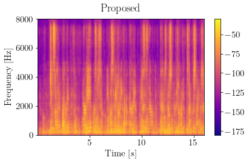
      <audio controls>
        <source src="examples/exs5/ds2/proposed.wav" type="audio/mpeg">
        Your browser does not support the audio element.
      </audio>
      R_interf=-12.59dB
    </td>
  </tr>
  <!-- DATASET 3 -->
  <tr> 
    <td>
      I = 4  
      d = 52mm
    </td>
    <td>
      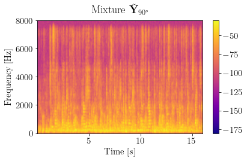
      <audio controls>
        <source src="examples/exs5/ds3/mixture_beamspace.wav" type="audio/mpeg">
        Your browser does not support the audio element.
      </audio>
      R_interf= -
    </td>
    <td>
      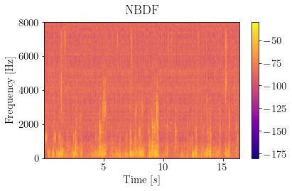
      <audio controls>
        <source src="examples/exs5/ds3/nbdf.wav" type="audio/mpeg">
        Your browser does not support the audio element.
      </audio>
      R_interf=-13.46dB
    </td>
    <td>
      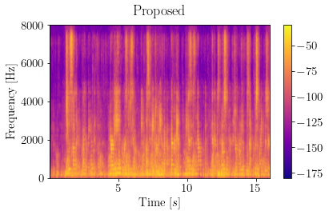
      <audio controls>
        <source src="examples/exs5/ds3/proposed.wav" type="audio/mpeg">
        Your browser does not support the audio element.
      </audio>
      R_interf=-13.68dB
    </td>
  </tr>
</table>
 -->
<!-- ***************************************** EXAMPLE 6 *************************************************** -->
<!-- 

<table style="width: 100%; table-layout: fixed; word-wrap: normal;">
  <!-- SETUP -->
  <tr> 
    <th colspan="4" style="text-align:center;">EXAMPLE 6</th>
  </tr>
  <tr>
    <td>
      Setup  
      SOI=0  
      R=3
    </td>
    <td>
      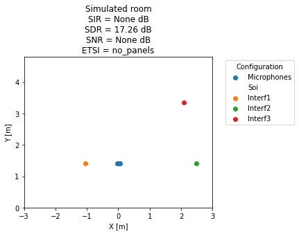
    </td>
    <td>
      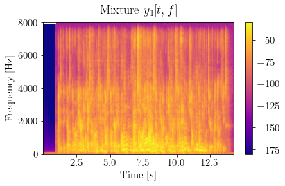
      <audio controls>
        <source src="examples/exs6/ds1/mixture_mic0.wav" type="audio/mpeg">
        Your browser does not support the audio element.
      </audio>
    </td>
    <td>
      
      <audio controls>
        <source src="examples/exs6/ds1/target_beamspace.wav" type="audio/mpeg">
        Your browser does not support the audio element.
      </audio>
    </td>
  </tr>
  <!-- TITLE 
  <tr> 
    <td>
      Dataset
    </td>
    <td>
      Mixture Beamspace
    </td>
    <td>
      NBDF method
    </td>
    <td>
      Proposed method
    </td>
  </tr>
  -->
  <!-- DATASET 1 -->
  <tr> 
    <td>
      I = 4  
      d = 26mm
    </td>
    <td>
      
      <audio controls>
        <source src="examples/exs6/ds1/mixture_beamspace.wav" type="audio/mpeg">
        Your browser does not support the audio element.
      </audio>
      R_interf= -
    </td>
    <td>
      
      <audio controls>
        <source src="examples/exs6/ds1/nbdf.wav" type="audio/mpeg">
        Your browser does not support the audio element.
      </audio>
      R_interf=-38.16dB
    </td>
    <td>
      
      <audio controls>
        <source src="examples/exs6/ds1/proposed.wav" type="audio/mpeg">
        Your browser does not support the audio element.
      </audio>
      R_interf=-43.03dB
    </td>
  </tr>
  <!-- DATASET 2 -->
  <tr> 
    <td>
      I = 3  
      d = 52mm
    </td>
    <td>
      
      <audio controls>
        <source src="examples/exs6/ds2/mixture_beamspace.wav" type="audio/mpeg">
        Your browser does not support the audio element.
      </audio>
      R_interf= -
    </td>
    <td>
      
      <audio controls>
        <source src="examples/exs6/ds2/nbdf.wav" type="audio/mpeg">
        Your browser does not support the audio element.
      </audio>
      R_interf=-24.94dB
    </td>
    <td>
      
      <audio controls>
        <source src="examples/exs6/ds2/proposed.wav" type="audio/mpeg">
        Your browser does not support the audio element.
      </audio>
      R_interf=-17.58dB
    </td>
  </tr>
  <!-- DATASET 3 -->
  <tr> 
    <td>
      I = 4  
      d = 52mm
    </td>
    <td>
      
      <audio controls>
        <source src="examples/exs6/ds3/mixture_beamspace.wav" type="audio/mpeg">
        Your browser does not support the audio element.
      </audio>
      R_interf= - 
    </td>
    <td>
      
      <audio controls>
        <source src="examples/exs6/ds3/nbdf.wav" type="audio/mpeg">
        Your browser does not support the audio element.
      </audio>
      R_interf=-27.78dB
    </td>
    <td>
      
      <audio controls>
        <source src="examples/exs6/ds3/proposed.wav" type="audio/mpeg">
        Your browser does not support the audio element.
      </audio>
      R_interf=-22.11dB
    </td>
  </tr>
</table>
 -->
