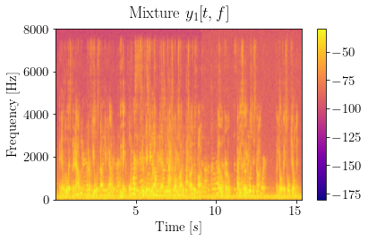

# Abstract
In the context of source separation solutions for virtual reality applications, several techniques in the spherical harmonics domain have been proposed in the literature. The performance of such methods is limited under high reverberation conditions and the rendering of the obtained spatial sound is fixed to the recording location only. Recently, novel sound field works in the literature proposed a global representation that enables both the direct sound (exterior field) estimation and the reconstruction in locations different from the acquisition ones. In this paper, we propose a signal processing framework based on Multichannel Non-Negative Matrix Factorization in the spherical harmonics domain that operates directly over the exterior field coefficients enabling the reconstruction of the direct sound field of the separated sources. To evaluate our proposal, we compared with other state-of-the-art source separation approaches using several setups and including different reverberation conditions, showing promising results in terms of BSS_eval metrics.

[!WARNING]  
The related manuscript is currently under review.

# Listening tests
Here below we report some audio examples accompanying the paper.  
For each example we included the mixture, the exterior field estimation (Eq. 15), which is the dereverberated input of the MNMF algorithms, the estimates obtained by the proposed method varying spherical harmonics order $\tilde{N}'_E$, the estimates using ILRMA and FastMNMF and the reference exterior field for each source.  
The collected mono signals are obtained averaging the signals of all the sensors.

<!-- FIRST EXAMPLE -->
<table style="width: 100%; table-layout: fixed; word-wrap: normal;">
  <!-- SETUP -->
  <tr> 
    <th colspan="8" style="text-align:center;">EXAMPLE 1: 4 HOMs, 2 Female sources Mixture <audio controls><source src="examples/exs1/2source/1position/4array/30/mix_mono.wav" type="audio/mpeg">
        Your browser does not support the audio element.
      </audio></th>
  </tr>
  <tr>
    <td>
      <!-- Source position: 1   -->
      T60: 0.3[s] 
    </td>
    <td>
      Estimated Exterior field (input of MNMF algorithms)
      <audio controls>
        <source src="examples/exs1/2source/1position/4array/30/input_mono.wav" type="audio/mpeg">
        Your browser does not support the audio element.
      </audio>
    </td>
    <td>
      <!--  -->
      Sph order: 1  
      Source 1
      <audio controls>
        <source src="examples/exs1/2source/1position/4array/30/1order/est1_mono.wav" type="audio/mpeg">
        Your browser does not support the audio element.
      </audio> 
      Source 2
      <audio controls>
        <source src="examples/exs1/2source/1position/4array/30/1order/est2_mono.wav" type="audio/mpeg">
        Your browser does not support the audio element.
      </audio>
    </td>
    <td>
      <!--  -->
      Sph order: 2  
      Source 1
      <audio controls>
        <source src="examples/exs1/2source/1position/4array/30/2order/est1_mono.wav" type="audio/mpeg">
        Your browser does not support the audio element.
      </audio> 
      Source 2
      <audio controls>
        <source src="examples/exs1/2source/1position/4array/30/2order/est2_mono.wav" type="audio/mpeg">
        Your browser does not support the audio element.
      </audio>
    </td>
    <td>
      <!--  -->
      Sph order: 3  
      Source 1
      <audio controls>
        <source src="examples/exs1/2source/1position/4array/30/3order/est1_mono.wav" type="audio/mpeg">
        Your browser does not support the audio element.
      </audio> 
      Source 2
      <audio controls>
        <source src="examples/exs1/2source/1position/4array/30/3order/est2_mono.wav" type="audio/mpeg">
        Your browser does not support the audio element.
      </audio>
    </td>
    <td>
      <!--  -->
      ILRMA  
      Source 1
      <audio controls>
        <source src="examples/exs1/2source/1position/4array/30/ilrma_est_1_mono.wav" type="audio/mpeg">
        Your browser does not support the audio element.
      </audio> 
      Source 2
      <audio controls>
        <source src="examples/exs1/2source/1position/4array/30/ilrma_est_2_mono.wav" type="audio/mpeg">
        Your browser does not support the audio element.
      </audio>
    </td>
    <td>
      <!--  -->
      FastMNMF  
      Source 1
      <audio controls>
        <source src="examples/exs1/2source/1position/4array/30/fast_source_1_mono.wav" type="audio/mpeg">
        Your browser does not support the audio element.
      </audio> 
      Source 2
      <audio controls>
        <source src="examples/exs1/2source/1position/4array/30/fast_source_2_mono.wav" type="audio/mpeg">
        Your browser does not support the audio element.
      </audio>
    </td>
    <td>
      Exterior Field Reference  
      Source 1
      <audio controls>
        <source src="examples/exs1/2source/1position/4array/30/1order/estFede1_mono.wav" type="audio/mpeg">
        Your browser does not support the audio element.
      </audio> 
      Source 2
      <audio controls>
        <source src="examples/exs1/2source/1position/4array/30/1order/estFede2_mono.wav" type="audio/mpeg">
        Your browser does not support the audio element.
      </audio>
    </td>
  </tr> 
</table>

<!-- SECOND EXAMPLE -->
<table style="width: 100%; table-layout: fixed; word-wrap: normal;">
  <!-- SETUP -->
  <tr> 
    <th colspan="8" style="text-align:center;">EXAMPLE 2: 8 HOMs, 2 Female sources Mixture <audio controls><source src="examples/exs1/2source/2_position/8_array/120/mix_mono.wav" type="audio/mpeg">
        Your browser does not support the audio element.
      </audio></th>
  </tr>
  <tr>
    <td>
      <!-- Source position: 2   -->
      T60: 1.2[s] 
    </td>
    <td>
      Estimated Exterior field (input of MNMF algorithms)
      <audio controls>
        <source src="examples/exs1/2source/2_position/8_array/120/input_mono.wav" type="audio/mpeg">
        Your browser does not support the audio element.
      </audio>
    </td>
    <td>
      <!--  -->
      Sph order: 1  
      Source 1
      <audio controls>
        <source src="examples/exs1/2source/2_position/8_array/120/1_order/est1_mono.wav" type="audio/mpeg">
        Your browser does not support the audio element.
      </audio> 
      Source 2
      <audio controls>
        <source src="examples/exs1/2source/2_position/8_array/120/1_order/est2_mono.wav" type="audio/mpeg">
        Your browser does not support the audio element.
      </audio>
    </td>
    <td>
      <!--  -->
      Sph order: 2  
      Source 1
      <audio controls>
        <source src="examples/exs1/2source/2_position/8_array/120/2_order/est1_mono.wav" type="audio/mpeg">
        Your browser does not support the audio element.
      </audio> 
      Source 2
      <audio controls>
        <source src="examples/exs1/2source/2_position/8_array/120/2_order/est2_mono.wav" type="audio/mpeg">
        Your browser does not support the audio element.
      </audio>
    </td>
    <td>
      <!--  -->
      Sph order: 3  
      Source 1
      <audio controls>
        <source src="examples/exs1/2source/2_position/8_array/120/3_order/est1_mono.wav" type="audio/mpeg">
        Your browser does not support the audio element.
      </audio> 
      Source 2
      <audio controls>
        <source src="examples/exs1/2source/2_position/8_array/120/3_order/est2_mono.wav" type="audio/mpeg">
        Your browser does not support the audio element.
      </audio>
    </td>
    <td>
      <!--  -->
      ILRMA  
      Source 1
      <audio controls>
        <source src="examples/exs1/2source/2_position/8_array/120/ilrma_est_1_mono.wav" type="audio/mpeg">
        Your browser does not support the audio element.
      </audio> 
      Source 2
      <audio controls>
        <source src="examples/exs1/2source/2_position/8_array/120/ilrma_est_2_mono.wav" type="audio/mpeg">
        Your browser does not support the audio element.
      </audio>
    </td>
    <td>
      <!--  -->
      FastMNMF  
      Source 1
      <audio controls>
        <source src="examples/exs1/2source/2_position/8_array/120/fast_source_1_mono.wav" type="audio/mpeg">
        Your browser does not support the audio element.
      </audio> 
      Source 2
      <audio controls>
        <source src="examples/exs1/2source/2_position/8_array/120/fast_source_2_mono.wav" type="audio/mpeg">
        Your browser does not support the audio element.
      </audio>
    </td>
    <td>
      Exterior Field Reference  
      Source 1
      <audio controls>
        <source src="examples/exs1/2source/2_position/8_array/120/1_order/estFede1_mono.wav" type="audio/mpeg">
        Your browser does not support the audio element.
      </audio> 
      Source 2
      <audio controls>
        <source src="examples/exs1/2source/2_position/8_array/120/1_order/estFede2_mono.wav" type="audio/mpeg">
        Your browser does not support the audio element.
      </audio>
    </td>
  </tr> 
</table>

<!-- THIRD EXAMPLE -->
<table style="width: 100%; table-layout: fixed; word-wrap: normal;">
  <!-- SETUP -->
  <tr> 
    <th colspan="8" style="text-align:center;">EXAMPLE 3: 16 HOMs, 2 Female sources Mixture <audio controls><source src="examples/exs1/2source/3_position/16_array/60/mix_mono.wav" type="audio/mpeg">
        Your browser does not support the audio element.
      </audio></th>
  </tr>
  <tr>
    <td>
      <!-- Source position: 3   -->
      T60: 0.6[s] 
    </td>
    <td>
      Estimated Exterior field (input of MNMF algorithms)
      <audio controls>
        <source src="examples/exs1/2source/3_position/16_array/60/input_mono.wav" type="audio/mpeg">
        Your browser does not support the audio element.
      </audio>
    </td>
    <td>
      <!--  -->
      Sph order: 1  
      Source 1
      <audio controls>
        <source src="examples/exs1/2source/3_position/16_array/60/1_order/est1_mono.wav" type="audio/mpeg">
        Your browser does not support the audio element.
      </audio> 
      Source 2
      <audio controls>
        <source src="examples/exs1/2source/3_position/16_array/60/1_order/est2_mono.wav" type="audio/mpeg">
        Your browser does not support the audio element.
      </audio>
    </td>
    <td>
      <!--  -->
      Sph order: 2  
      Source 1
      <audio controls>
        <source src="examples/exs1/2source/3_position/16_array/60/2_order/est1_mono.wav" type="audio/mpeg">
        Your browser does not support the audio element.
      </audio> 
      Source 2
      <audio controls>
        <source src="examples/exs1/2source/3_position/16_array/60/2_order/est2_mono.wav" type="audio/mpeg">
        Your browser does not support the audio element.
      </audio>
    </td>
    <td>
      <!--  -->
      Sph order: 3  
      Source 1
      <audio controls>
        <source src="examples/exs1/2source/3_position/16_array/60/3_order/est1_mono.wav" type="audio/mpeg">
        Your browser does not support the audio element.
      </audio> 
      Source 2
      <audio controls>
        <source src="examples/exs1/2source/3_position/16_array/60/3_order/est2_mono.wav" type="audio/mpeg">
        Your browser does not support the audio element.
      </audio>
    </td>
    <td>
      <!--  -->
      ILRMA  
      Source 1
      <audio controls>
        <source src="examples/exs1/2source/3_position/16_array/60/ilrma_est_1_mono.wav" type="audio/mpeg">
        Your browser does not support the audio element.
      </audio> 
      Source 2
      <audio controls>
        <source src="examples/exs1/2source/3_position/16_array/60/ilrma_est_2_mono.wav" type="audio/mpeg">
        Your browser does not support the audio element.
      </audio>
    </td>
    <td>
      <!--  -->
      FastMNMF  
      Source 1
      <audio controls>
        <source src="examples/exs1/2source/3_position/16_array/60/fast_source_1_mono.wav" type="audio/mpeg">
        Your browser does not support the audio element.
      </audio> 
      Source 2
      <audio controls>
        <source src="examples/exs1/2source/3_position/16_array/60/fast_source_2_mono.wav" type="audio/mpeg">
        Your browser does not support the audio element.
      </audio>
    </td>
    <td>
      Exterior Field Reference  
      Source 1
      <audio controls>
        <source src="examples/exs1/2source/3_position/16_array/60/1_order/estFede1_mono.wav" type="audio/mpeg">
        Your browser does not support the audio element.
      </audio> 
      Source 2
      <audio controls>
        <source src="examples/exs1/2source/3_position/16_array/60/1_order/estFede2_mono.wav" type="audio/mpeg">
        Your browser does not support the audio element.
      </audio>
    </td>
  </tr> 
</table>

<!-- FOURTH EXAMPLE -->
<table style="width: 100%; table-layout: fixed; word-wrap: normal;">
  <!-- SETUP -->
  <tr> 
    <th colspan="8" style="text-align:center;">EXAMPLE 4: 8 HOMs, 3 Female sources Mixture <audio controls><source src="examples/exs2/3_source/1_position/8_array/60/mix_mono.wav" type="audio/mpeg">
        Your browser does not support the audio element.
      </audio></th>
  </tr>
  <tr>
    <td>
      <!-- Source position: 3   -->
      T60: 0.6[s] 
    </td>
    <td>
      Estimated Exterior field (input of MNMF algorithms)
      <audio controls>
        <source src="examples/exs2/3_source/1_position/8_array/60/input_mono.wav" type="audio/mpeg">
        Your browser does not support the audio element.
      </audio>
    </td>
    <td>
      <!--  -->
      Sph order: 1  
      Source 1
      <audio controls>
        <source src="examples/exs2/3_source/1_position/8_array/60/1_order/est1_mono.wav" type="audio/mpeg">
        Your browser does not support the audio element.
      </audio> 
      Source 2
      <audio controls>
        <source src="examples/exs2/3_source/1_position/8_array/60/1_order/est2_mono.wav" type="audio/mpeg">
        Your browser does not support the audio element.
      </audio>
       
      Source 3
      <audio controls>
        <source src="examples/exs2/3_source/1_position/8_array/60/1_order/est3_mono.wav" type="audio/mpeg">
        Your browser does not support the audio element.
      </audio>
    </td>
    <td>
      <!--  -->
      Sph order: 2  
      Source 1
      <audio controls>
        <source src="examples/exs2/3_source/1_position/8_array/60/2_order/est1_mono.wav" type="audio/mpeg">
        Your browser does not support the audio element.
      </audio> 
      Source 2
      <audio controls>
        <source src="examples/exs2/3_source/1_position/8_array/60/2_order/est2_mono.wav" type="audio/mpeg">
        Your browser does not support the audio element.
      </audio> 
      Source 3
      <audio controls>
        <source src="examples/exs2/3_source/1_position/8_array/60/2_order/est3_mono.wav" type="audio/mpeg">
        Your browser does not support the audio element.
      </audio>
    </td>
    <td>
      <!--  -->
      Sph order: 3  
      Source 1
      <audio controls>
        <source src="examples/exs2/3_source/1_position/8_array/60/3_order/est1_mono.wav" type="audio/mpeg">
        Your browser does not support the audio element.
      </audio> 
      Source 2
      <audio controls>
        <source src="examples/exs2/3_source/1_position/8_array/60/3_order/est2_mono.wav" type="audio/mpeg">
        Your browser does not support the audio element.
      </audio> 
      Source 3
      <audio controls>
        <source src="examples/exs2/3_source/1_position/8_array/60/3_order/est3_mono.wav" type="audio/mpeg">
        Your browser does not support the audio element.
      </audio>
    </td>
    <td>
      <!--  -->
      ILRMA  
      Source 1
      <audio controls>
        <source src="examples/exs2/3_source/1_position/8_array/60/ilrma_est_1_mono.wav" type="audio/mpeg">
        Your browser does not support the audio element.
      </audio> 
      Source 2
      <audio controls>
        <source src="examples/exs2/3_source/1_position/8_array/60/ilrma_est_2_mono.wav" type="audio/mpeg">
        Your browser does not support the audio element.
      </audio> 
      Source 3
      <audio controls>
        <source src="examples/exs2/3_source/1_position/8_array/60/ilrma_est_3_mono.wav" type="audio/mpeg">
        Your browser does not support the audio element.
      </audio>
    </td>
    <td>
      <!--  -->
      FastMNMF  
      Source 1
      <audio controls>
        <source src="examples/exs2/3_source/1_position/8_array/60/fast_source_1_mono.wav" type="audio/mpeg">
        Your browser does not support the audio element.
      </audio> 
      Source 2
      <audio controls>
        <source src="examples/exs2/3_source/1_position/8_array/60/fast_source_2_mono.wav" type="audio/mpeg">
        Your browser does not support the audio element.
      </audio>
       
      Source 3
      <audio controls>
        <source src="examples/exs2/3_source/1_position/8_array/60/fast_source_3_mono.wav" type="audio/mpeg">
        Your browser does not support the audio element.
      </audio>
    </td>
    <td>
      Exterior Field Reference  
      Source 1
      <audio controls>
        <source src="examples/exs2/3_source/1_position/8_array/60/1_order/estFede1_mono.wav" type="audio/mpeg">
        Your browser does not support the audio element.
      </audio> 
      Source 2
      <audio controls>
        <source src="examples/exs2/3_source/1_position/8_array/60/1_order/estFede2_mono.wav" type="audio/mpeg">
        Your browser does not support the audio element.
      </audio> 
      Source 3
      <audio controls>
        <source src="examples/exs2/3_source/1_position/8_array/60/1_order/estFede3_mono.wav" type="audio/mpeg">
        Your browser does not support the audio element.
      </audio>
    </td>
  </tr> 
</table>

<!-- Fifth EXAMPLE -->
<table style="width: 100%; table-layout: fixed; word-wrap: normal;">
  <!-- SETUP -->
  <tr> 
    <th colspan="8" style="text-align:center;">EXAMPLE 5: 16 HOMs, 3 Female sources Mixture <audio controls><source src="examples/exs2/3_source/2_position/16_array/30/mix_mono.wav" type="audio/mpeg">
        Your browser does not support the audio element.
      </audio></th>
  </tr>
  <tr>
    <td>
      <!-- Source position: 2   -->
      T60: 0.3[s] 
    </td>
    <td>
      Estimated Exterior field (input of MNMF algorithms)
      <audio controls>
        <source src="examples/exs2/3_source/2_position/16_array/30/input_mono.wav" type="audio/mpeg">
        Your browser does not support the audio element.
      </audio>
    </td>
    <td>
      <!--  -->
      Sph order: 1  
      Source 1
      <audio controls>
        <source src="examples/exs2/3_source/2_position/16_array/30/1_order/est1_mono.wav" type="audio/mpeg">
        Your browser does not support the audio element.
      </audio> 
      Source 2
      <audio controls>
        <source src="examples/exs2/3_source/2_position/16_array/30/1_order/est2_mono.wav" type="audio/mpeg">
        Your browser does not support the audio element.
      </audio>
       
      Source 3
      <audio controls>
        <source src="examples/exs2/3_source/2_position/16_array/30/1_order/est3_mono.wav" type="audio/mpeg">
        Your browser does not support the audio element.
      </audio>
    </td>
    <td>
      <!--  -->
      Sph order: 2  
      Source 1
      <audio controls>
        <source src="examples/exs2/3_source/2_position/16_array/30/2_order/est1_mono.wav" type="audio/mpeg">
        Your browser does not support the audio element.
      </audio> 
      Source 2
      <audio controls>
        <source src="examples/exs2/3_source/2_position/16_array/30/2_order/est2_mono.wav" type="audio/mpeg">
        Your browser does not support the audio element.
      </audio> 
      Source 3
      <audio controls>
        <source src="examples/exs2/3_source/2_position/16_array/30/2_order/est3_mono.wav" type="audio/mpeg">
        Your browser does not support the audio element.
      </audio>
    </td>
    <td>
      <!--  -->
      Sph order: 3  
      Source 1
      <audio controls>
        <source src="examples/exs2/3_source/2_position/16_array/30/3_order/est1_mono.wav" type="audio/mpeg">
        Your browser does not support the audio element.
      </audio> 
      Source 2
      <audio controls>
        <source src="examples/exs2/3_source/2_position/16_array/30/3_order/est2_mono.wav" type="audio/mpeg">
        Your browser does not support the audio element.
      </audio> 
      Source 3
      <audio controls>
        <source src="examples/exs2/3_source/2_position/16_array/30/3_order/est3_mono.wav" type="audio/mpeg">
        Your browser does not support the audio element.
      </audio>
    </td>
    <td>
      <!--  -->
      ILRMA  
      Source 1
      <audio controls>
        <source src="examples/exs2/3_source/2_position/16_array/30/ilrma_est_1_mono.wav" type="audio/mpeg">
        Your browser does not support the audio element.
      </audio> 
      Source 2
      <audio controls>
        <source src="examples/exs2/3_source/2_position/16_array/30/ilrma_est_2_mono.wav" type="audio/mpeg">
        Your browser does not support the audio element.
      </audio> 
      Source 3
      <audio controls>
        <source src="examples/exs2/3_source/2_position/16_array/30/ilrma_est_3_mono.wav" type="audio/mpeg">
        Your browser does not support the audio element.
      </audio>
    </td>
    <td>
      <!--  -->
      FastMNMF  
      Source 1
      <audio controls>
        <source src="examples/exs2/3_source/2_position/16_array/30/fast_source_1_mono.wav" type="audio/mpeg">
        Your browser does not support the audio element.
      </audio> 
      Source 2
      <audio controls>
        <source src="examples/exs2/3_source/2_position/16_array/30/fast_source_2_mono.wav" type="audio/mpeg">
        Your browser does not support the audio element.
      </audio>
       
      Source 3
      <audio controls>
        <source src="examples/exs2/3_source/2_position/16_array/30/fast_source_3_mono.wav" type="audio/mpeg">
        Your browser does not support the audio element.
      </audio>
    </td>
    <td>
      Exterior Field Reference  
      Source 1
      <audio controls>
        <source src="examples/exs2/3_source/2_position/16_array/30/1_order/estFede1_mono.wav" type="audio/mpeg">
        Your browser does not support the audio element.
      </audio> 
      Source 2
      <audio controls>
        <source src="examples/exs2/3_source/2_position/16_array/30/1_order/estFede2_mono.wav" type="audio/mpeg">
        Your browser does not support the audio element.
      </audio> 
      Source 3
      <audio controls>
        <source src="examples/exs2/3_source/2_position/16_array/30/1_order/estFede3_mono.wav" type="audio/mpeg">
        Your browser does not support the audio element.
      </audio>
    </td>
  </tr> 
</table>

<!-- Sixth EXAMPLE -->
<table style="width: 100%; table-layout: fixed; word-wrap: normal;">
  <!-- SETUP -->
  <tr> 
    <th colspan="8" style="text-align:center;">EXAMPLE 6: 4 HOMs, 2 Male sources Mixture <audio controls><source src="examples/exs3/2_source/1_position/4_array/30/mix_mono.wav" type="audio/mpeg">
        Your browser does not support the audio element.
      </audio></th>
  </tr>
  <tr>
    <td>
      <!-- Source position: 1   -->
      T60: 0.3[s] 
    </td>
    <td>
      Estimated Exterior field (input of MNMF algorithms)
      <audio controls>
        <source src="examples/exs3/2_source/1_position/4_array/30/input_mono.wav" type="audio/mpeg">
        Your browser does not support the audio element.
      </audio>
    </td>
    <td>
      <!--  -->
      Sph order: 1  
      Source 1
      <audio controls>
        <source src="examples/exs3/2_source/1_position/4_array/30/1_order/est1_mono.wav" type="audio/mpeg">
        Your browser does not support the audio element.
      </audio> 
      Source 2
      <audio controls>
        <source src="examples/exs3/2_source/1_position/4_array/30/1_order/est2_mono.wav" type="audio/mpeg">
        Your browser does not support the audio element.
      </audio>
    </td>
    <td>
      <!--  -->
      Sph order: 2  
      Source 1
      <audio controls>
        <source src="examples/exs3/2_source/1_position/4_array/30/2_order/est1_mono.wav" type="audio/mpeg">
        Your browser does not support the audio element.
      </audio> 
      Source 2
      <audio controls>
        <source src="examples/exs3/2_source/1_position/4_array/30/2_order/est2_mono.wav" type="audio/mpeg">
        Your browser does not support the audio element.
      </audio>
    </td>
    <td>
      <!--  -->
      Sph order: 3  
      Source 1
      <audio controls>
        <source src="examples/exs3/2_source/1_position/4_array/30/3_order/est1_mono.wav" type="audio/mpeg">
        Your browser does not support the audio element.
      </audio> 
      Source 2
      <audio controls>
        <source src="examples/exs3/2_source/1_position/4_array/30/3_order/est2_mono.wav" type="audio/mpeg">
        Your browser does not support the audio element.
      </audio>
    </td>
    <td>
      <!--  -->
      ILRMA  
      Source 1
      <audio controls>
        <source src="examples/exs3/2_source/1_position/4_array/30/ilrma_est_1_mono.wav" type="audio/mpeg">
        Your browser does not support the audio element.
      </audio> 
      Source 2
      <audio controls>
        <source src="examples/exs3/2_source/1_position/4_array/30/ilrma_est_2_mono.wav" type="audio/mpeg">
        Your browser does not support the audio element.
      </audio>
    </td>
    <td>
      <!--  -->
      FastMNMF  
      Source 1
      <audio controls>
        <source src="examples/exs3/2_source/1_position/4_array/30/fast_source_1_mono.wav" type="audio/mpeg">
        Your browser does not support the audio element.
      </audio> 
      Source 2
      <audio controls>
        <source src="examples/exs3/2_source/1_position/4_array/30/fast_source_2_mono.wav" type="audio/mpeg">
        Your browser does not support the audio element.
      </audio>
    </td>
    <td>
      Exterior Field Reference  
      Source 1
      <audio controls>
        <source src="examples/exs3/2_source/1_position/4_array/30/1_order/estFede1_mono.wav" type="audio/mpeg">
        Your browser does not support the audio element.
      </audio> 
      Source 2
      <audio controls>
        <source src="examples/exs3/2_source/1_position/4_array/30/1_order/estFede2_mono.wav" type="audio/mpeg">
        Your browser does not support the audio element.
      </audio> 
    </td>
  </tr> 
</table>

<!-- Seventh EXAMPLE -->
<table style="width: 100%; table-layout: fixed; word-wrap: normal;">
  <!-- SETUP -->
  <tr> 
    <th colspan="8" style="text-align:center;">EXAMPLE 7: 8 HOMs, 2 Male sources Mixture <audio controls><source src="examples/exs3/2_source/1_position/8_array/60/mix_mono.wav" type="audio/mpeg">
        Your browser does not support the audio element.
      </audio></th>
  </tr>
  <tr>
    <td>
      <!-- Source position: 1   -->
      T60: 0.6[s] 
    </td>
    <td>
      Estimated Exterior field (input of MNMF algorithms)
      <audio controls>
        <source src="examples/exs3/2_source/1_position/8_array/60/input_mono.wav" type="audio/mpeg">
        Your browser does not support the audio element.
      </audio>
    </td>
    <td>
      <!--  -->
      Sph order: 1  
      Source 1
      <audio controls>
        <source src="examples/exs3/2_source/1_position/8_array/60/1_order/est1_mono.wav" type="audio/mpeg">
        Your browser does not support the audio element.
      </audio> 
      Source 2
      <audio controls>
        <source src="examples/exs3/2_source/1_position/8_array/60/1_order/est2_mono.wav" type="audio/mpeg">
        Your browser does not support the audio element.
      </audio>
    </td>
    <td>
      <!--  -->
      Sph order: 2  
      Source 1
      <audio controls>
        <source src="examples/exs3/2_source/1_position/8_array/60/2_order/est1_mono.wav" type="audio/mpeg">
        Your browser does not support the audio element.
      </audio> 
      Source 2
      <audio controls>
        <source src="examples/exs3/2_source/1_position/8_array/60/2_order/est2_mono.wav" type="audio/mpeg">
        Your browser does not support the audio element.
      </audio>
    </td>
    <td>
      <!--  -->
      Sph order: 3  
      Source 1
      <audio controls>
        <source src="examples/exs3/2_source/1_position/8_array/60/3_order/est1_mono.wav" type="audio/mpeg">
        Your browser does not support the audio element.
      </audio> 
      Source 2
      <audio controls>
        <source src="examples/exs3/2_source/1_position/8_array/60/3_order/est2_mono.wav" type="audio/mpeg">
        Your browser does not support the audio element.
      </audio>
    </td>
    <td>
      <!--  -->
      ILRMA  
      Source 1
      <audio controls>
        <source src="examples/exs3/2_source/1_position/8_array/60/ilrma_est_1_mono.wav" type="audio/mpeg">
        Your browser does not support the audio element.
      </audio> 
      Source 2
      <audio controls>
        <source src="examples/exs3/2_source/1_position/8_array/60/ilrma_est_2_mono.wav" type="audio/mpeg">
        Your browser does not support the audio element.
      </audio>
    </td>
    <td>
      <!--  -->
      FastMNMF  
      Source 1
      <audio controls>
        <source src="examples/exs3/2_source/1_position/8_array/60/fast_source_1_mono.wav" type="audio/mpeg">
        Your browser does not support the audio element.
      </audio> 
      Source 2
      <audio controls>
        <source src="examples/exs3/2_source/1_position/8_array/60/fast_source_2_mono.wav" type="audio/mpeg">
        Your browser does not support the audio element.
      </audio>
    </td>
    <td>
      Exterior Field Reference  
      Source 1
      <audio controls>
        <source src="examples/exs3/2_source/1_position/8_array/60/1_order/estFede1_mono.wav" type="audio/mpeg">
        Your browser does not support the audio element.
      </audio> 
      Source 2
      <audio controls>
        <source src="examples/exs3/2_source/1_position/8_array/60/1_order/estFede2_mono.wav" type="audio/mpeg">
        Your browser does not support the audio element.
      </audio>
    </td>
  </tr> 
</table>

<!-- Eighth EXAMPLE -->
<table style="width: 100%; table-layout: fixed; word-wrap: normal;">
  <!-- SETUP -->
  <tr> 
    <th colspan="8" style="text-align:center;">EXAMPLE 8: 16 HOMs, 2 Male sources Mixture <audio controls><source src="examples/exs3/2_source/2_position/16_array/120/mix_mono.wav" type="audio/mpeg">
        Your browser does not support the audio element.
      </audio></th>
  </tr>
  <tr>
    <td>
      <!-- Source position: 2   -->
      T60: 1.2[s] 
    </td>
    <td>
      Estimated Exterior field (input of MNMF algorithms)
      <audio controls>
        <source src="examples/exs3/2_source/2_position/16_array/120/input_mono.wav" type="audio/mpeg">
        Your browser does not support the audio element.
      </audio>
    </td>
    <td>
      <!--  -->
      Sph order: 1  
      Source 1
      <audio controls>
        <source src="examples/exs3/2_source/2_position/16_array/120/1_order/est1_mono.wav" type="audio/mpeg">
        Your browser does not support the audio element.
      </audio> 
      Source 2
      <audio controls>
        <source src="examples/exs3/2_source/2_position/16_array/120/1_order/est2_mono.wav" type="audio/mpeg">
        Your browser does not support the audio element.
      </audio>
    </td>
    <td>
      <!--  -->
      Sph order: 2  
      Source 1
      <audio controls>
        <source src="examples/exs3/2_source/2_position/16_array/120/2_order/est1_mono.wav" type="audio/mpeg">
        Your browser does not support the audio element.
      </audio> 
      Source 2
      <audio controls>
        <source src="examples/exs3/2_source/2_position/16_array/120/2_order/est2_mono.wav" type="audio/mpeg">
        Your browser does not support the audio element.
      </audio>
    </td>
    <td>
      <!--  -->
      Sph order: 3  
      Source 1
      <audio controls>
        <source src="examples/exs3/2_source/2_position/16_array/120/3_order/est1_mono.wav" type="audio/mpeg">
        Your browser does not support the audio element.
      </audio> 
      Source 2
      <audio controls>
        <source src="examples/exs3/2_source/2_position/16_array/120/3_order/est2_mono.wav" type="audio/mpeg">
        Your browser does not support the audio element.
      </audio>
    </td>
    <td>
      <!--  -->
      ILRMA  
      Source 1
      <audio controls>
        <source src="examples/exs3/2_source/2_position/16_array/120/ilrma_est_1_mono.wav" type="audio/mpeg">
        Your browser does not support the audio element.
      </audio> 
      Source 2
      <audio controls>
        <source src="examples/exs3/2_source/2_position/16_array/120/ilrma_est_2_mono.wav" type="audio/mpeg">
        Your browser does not support the audio element.
      </audio>
    </td>
    <td>
      <!--  -->
      FastMNMF  
      Source 1
      <audio controls>
        <source src="examples/exs3/2_source/2_position/16_array/120/fast_source_1_mono.wav" type="audio/mpeg">
        Your browser does not support the audio element.
      </audio> 
      Source 2
      <audio controls>
        <source src="examples/exs3/2_source/2_position/16_array/120/fast_source_2_mono.wav" type="audio/mpeg">
        Your browser does not support the audio element.
      </audio>
    </td>
    <td>
      Exterior Field Reference  
      Source 1
      <audio controls>
        <source src="examples/exs3/2_source/2_position/16_array/120/1_order/estFede1_mono.wav" type="audio/mpeg">
        Your browser does not support the audio element.
      </audio> 
      Source 2
      <audio controls>
        <source src="examples/exs3/2_source/2_position/16_array/120/1_order/estFede2_mono.wav" type="audio/mpeg">
        Your browser does not support the audio element.
      </audio>
    </td>
  </tr> 
</table>

<!-- Nineth EXAMPLE -->
<table style="width: 100%; table-layout: fixed; word-wrap: normal;">
  <!-- SETUP -->
  <tr> 
    <th colspan="8" style="text-align:center;">EXAMPLE 9: 4 HOMs, 3 Male sources Mixture <audio controls><source src="examples/exs3/3_source/1_position/4_array/120/mix_mono.wav" type="audio/mpeg">
        Your browser does not support the audio element.
      </audio></th>
  </tr>
  <tr>
    <td>
      <!-- Source position: 1   -->
      T60: 1.2[s] 
    </td>
    <td>
      Estimated Exterior field (input of MNMF algorithms)
      <audio controls>
        <source src="examples/exs3/3_source/1_position/4_array/120/input_mono.wav" type="audio/mpeg">
        Your browser does not support the audio element.
      </audio>
    </td>
    <td>
      <!--  -->
      Sph order: 1  
      Source 1
      <audio controls>
        <source src="examples/exs3/3_source/1_position/4_array/120/1_order/est1.wav" type="audio/mpeg">
        Your browser does not support the audio element.
      </audio> 
      Source 2
      <audio controls>
        <source src="examples/exs3/3_source/1_position/4_array/120/1_order/est2.wav" type="audio/mpeg">
        Your browser does not support the audio element.
      </audio> 
      Source 3
      <audio controls>
        <source src="examples/exs3/3_source/1_position/4_array/120/1_order/est3.wav" type="audio/mpeg">
        Your browser does not support the audio element.
      </audio>
    </td>
    <td>
      <!--  -->
      Sph order: 2  
      Source 1
      <audio controls>
        <source src="examples/exs3/3_source/1_position/4_array/120/2_order/est1.wav" type="audio/mpeg">
        Your browser does not support the audio element.
      </audio> 
      Source 2
      <audio controls>
        <source src="examples/exs3/3_source/1_position/4_array/120/2_order/est2.wav" type="audio/mpeg">
        Your browser does not support the audio element.
      </audio> 
      Source 3
      <audio controls>
        <source src="examples/exs3/3_source/1_position/4_array/120/2_order/est3.wav" type="audio/mpeg">
        Your browser does not support the audio element.
      </audio>
    </td>
    <td>
      <!--  -->
      Sph order: 3  
      Source 1
      <audio controls>
        <source src="examples/exs3/3_source/1_position/4_array/120/3_order/est1.wav" type="audio/mpeg">
        Your browser does not support the audio element.
      </audio> 
      Source 2
      <audio controls>
        <source src="examples/exs3/3_source/1_position/4_array/120/3_order/est2.wav" type="audio/mpeg">
        Your browser does not support the audio element.
      </audio> 
      Source 3
      <audio controls>
        <source src="examples/exs3/3_source/1_position/4_array/120/3_order/est3.wav" type="audio/mpeg">
        Your browser does not support the audio element.
      </audio>
    </td>
    <td>
      <!--  -->
      ILRMA  
      Source 1
      <audio controls>
        <source src="examples/exs3/3_source/1_position/4_array/120/ilrma_est_1_mono.wav" type="audio/mpeg">
        Your browser does not support the audio element.
      </audio> 
      Source 2
      <audio controls>
        <source src="examples/exs3/3_source/1_position/4_array/120/ilrma_est_2_mono.wav" type="audio/mpeg">
        Your browser does not support the audio element.
      </audio> 
      Source 3
      <audio controls>
        <source src="examples/exs3/3_source/1_position/4_array/120/ilrma_est_3_mono.wav" type="audio/mpeg">
        Your browser does not support the audio element.
      </audio>
    </td>
    <td>
      <!--  -->
      FastMNMF  
      Source 1
      <audio controls>
        <source src="examples/exs3/3_source/1_position/4_array/120/fast_source_1_mono.wav" type="audio/mpeg">
        Your browser does not support the audio element.
      </audio> 
      Source 2
      <audio controls>
        <source src="examples/exs3/3_source/1_position/4_array/120/fast_source_2_mono.wav" type="audio/mpeg">
        Your browser does not support the audio element.
      </audio> 
      Source 3
      <audio controls>
        <source src="examples/exs3/3_source/1_position/4_array/120/fast_source_3_mono.wav" type="audio/mpeg">
        Your browser does not support the audio element.
      </audio>
    </td>
    <td>
      Exterior Field Reference  
      Source 1
      <audio controls>
        <source src="examples/exs3/3_source/1_position/4_array/120/1_order/estFede1.wav" type="audio/mpeg">
        Your browser does not support the audio element.
      </audio> 
      Source 2
      <audio controls>
        <source src="examples/exs3/3_source/1_position/4_array/120/1_order/estFede2.wav" type="audio/mpeg">
        Your browser does not support the audio element.
      </audio> 
      Source 3
      <audio controls>
        <source src="examples/exs3/3_source/1_position/4_array/120/1_order/estFede3.wav" type="audio/mpeg">
        Your browser does not support the audio element.
      </audio>
    </td>
  </tr> 
</table>

<!-- Tenth EXAMPLE -->
<table style="width: 100%; table-layout: fixed; word-wrap: normal;">
  <!-- SETUP -->
  <tr> 
    <th colspan="8" style="text-align:center;">EXAMPLE 10: 8 HOMs, 3 Male sources Mixture <audio controls><source src="examples/exs3/3_source/1_position/8_array/60/mix_mono.wav" type="audio/mpeg">
        Your browser does not support the audio element.
      </audio></th>
  </tr>
  <tr>
    <td>
      <!-- Source position: 1   -->
      T60: 0.6[s] 
    </td>
    <td>
      Estimated Exterior field (input of MNMF algorithms)
      <audio controls>
        <source src="examples/exs3/3_source/1_position/8_array/60/input_mono.wav" type="audio/mpeg">
        Your browser does not support the audio element.
      </audio>
    </td>
    <td>
      <!--  -->
      Sph order: 1  
      Source 1
      <audio controls>
        <source src="examples/exs3/3_source/1_position/8_array/60/1_order/est1.wav" type="audio/mpeg">
        Your browser does not support the audio element.
      </audio> 
      Source 2
      <audio controls>
        <source src="examples/exs3/3_source/1_position/8_array/60/1_order/est2.wav" type="audio/mpeg">
        Your browser does not support the audio element.
      </audio> 
      Source 3
      <audio controls>
        <source src="examples/exs3/3_source/1_position/8_array/60/1_order/est3.wav" type="audio/mpeg">
        Your browser does not support the audio element.
      </audio>
    </td>
    <td>
      <!--  -->
      Sph order: 2  
      Source 1
      <audio controls>
        <source src="examples/exs3/3_source/1_position/8_array/60/2_order/est1.wav" type="audio/mpeg">
        Your browser does not support the audio element.
      </audio> 
      Source 2
      <audio controls>
        <source src="examples/exs3/3_source/1_position/8_array/60/2_order/est2.wav" type="audio/mpeg">
        Your browser does not support the audio element.
      </audio> 
      Source 3
      <audio controls>
        <source src="examples/exs3/3_source/1_position/8_array/60/2_order/est3.wav" type="audio/mpeg">
        Your browser does not support the audio element.
      </audio>
    </td>
    <td>
      <!--  -->
      Sph order: 3  
      Source 1
      <audio controls>
        <source src="examples/exs3/3_source/1_position/8_array/60/3_order/est1.wav" type="audio/mpeg">
        Your browser does not support the audio element.
      </audio> 
      Source 2
      <audio controls>
        <source src="examples/exs3/3_source/1_position/8_array/60/3_order/est2.wav" type="audio/mpeg">
        Your browser does not support the audio element.
      </audio> 
      Source 3
      <audio controls>
        <source src="examples/exs3/3_source/1_position/8_array/60/3_order/est3.wav" type="audio/mpeg">
        Your browser does not support the audio element.
      </audio>
    </td>
    <td>
      <!--  -->
      ILRMA  
      Source 1
      <audio controls>
        <source src="examples/exs3/3_source/1_position/8_array/60/ilrma_est_1_mono.wav" type="audio/mpeg">
        Your browser does not support the audio element.
      </audio> 
      Source 2
      <audio controls>
        <source src="examples/exs3/3_source/1_position/8_array/60/ilrma_est_2_mono.wav" type="audio/mpeg">
        Your browser does not support the audio element.
      </audio> 
      Source 3
      <audio controls>
        <source src="examples/exs3/3_source/1_position/8_array/60/ilrma_est_3_mono.wav" type="audio/mpeg">
        Your browser does not support the audio element.
      </audio>
    </td>
    <td>
      <!--  -->
      FastMNMF  
      Source 1
      <audio controls>
        <source src="examples/exs3/3_source/1_position/8_array/60/fast_source_1_mono.wav" type="audio/mpeg">
        Your browser does not support the audio element.
      </audio> 
      Source 2
      <audio controls>
        <source src="examples/exs3/3_source/1_position/8_array/60/fast_source_2_mono.wav" type="audio/mpeg">
        Your browser does not support the audio element.
      </audio> 
      Source 3
      <audio controls>
        <source src="examples/exs3/3_source/1_position/8_array/60/fast_source_3_mono.wav" type="audio/mpeg">
        Your browser does not support the audio element.
      </audio>
    </td>
    <td>
      Exterior Field Reference  
      Source 1
      <audio controls>
        <source src="examples/exs3/3_source/1_position/8_array/60/1_order/estFede1.wav" type="audio/mpeg">
        Your browser does not support the audio element.
      </audio> 
      Source 2
      <audio controls>
        <source src="examples/exs3/3_source/1_position/8_array/60/1_order/estFede2.wav" type="audio/mpeg">
        Your browser does not support the audio element.
      </audio> 
      Source 3
      <audio controls>
        <source src="examples/exs3/3_source/1_position/8_array/60/1_order/estFede3.wav" type="audio/mpeg">
        Your browser does not support the audio element.
      </audio>
    </td>
  </tr> 
</table>

<!-- Eleventh EXAMPLE -->
<table style="width: 100%; table-layout: fixed; word-wrap: normal;">
  <!-- SETUP -->
  <tr> 
    <th colspan="8" style="text-align:center;">EXAMPLE 11: 16 HOMs, 3 Male sources Mixture <audio controls><source src="examples/exs3/3_source/1_position/16_array/30/mix_mono.wav" type="audio/mpeg">
        Your browser does not support the audio element.
      </audio></th>
  </tr>
  <tr>
    <td>
      <!-- Source position: 1   -->
      T60: 0.3[s] 
    </td>
    <td>
      Estimated Exterior field (input of MNMF algorithms)
      <audio controls>
        <source src="examples/exs3/3_source/1_position/16_array/30/input_mono.wav" type="audio/mpeg">
        Your browser does not support the audio element.
      </audio>
    </td>
    <td>
      <!--  -->
      Sph order: 1  
      Source 1
      <audio controls>
        <source src="examples/exs3/3_source/1_position/16_array/30/1_order/est1.wav" type="audio/mpeg">
        Your browser does not support the audio element.
      </audio> 
      Source 2
      <audio controls>
        <source src="examples/exs3/3_source/1_position/16_array/30/1_order/est2.wav" type="audio/mpeg">
        Your browser does not support the audio element.
      </audio> 
      Source 3
      <audio controls>
        <source src="examples/exs3/3_source/1_position/16_array/30/1_order/est3.wav" type="audio/mpeg">
        Your browser does not support the audio element.
      </audio>
    </td>
    <td>
      <!--  -->
      Sph order: 2  
      Source 1
      <audio controls>
        <source src="examples/exs3/3_source/1_position/16_array/30/2_order/est1.wav" type="audio/mpeg">
        Your browser does not support the audio element.
      </audio> 
      Source 2
      <audio controls>
        <source src="examples/exs3/3_source/1_position/16_array/30/2_order/est2.wav" type="audio/mpeg">
        Your browser does not support the audio element.
      </audio> 
      Source 3
      <audio controls>
        <source src="examples/exs3/3_source/1_position/16_array/30/2_order/est3.wav" type="audio/mpeg">
        Your browser does not support the audio element.
      </audio>
    </td>
    <td>
      <!--  -->
      Sph order: 3  
      Source 1
      <audio controls>
        <source src="examples/exs3/3_source/1_position/16_array/30/3_order/est1.wav" type="audio/mpeg">
        Your browser does not support the audio element.
      </audio> 
      Source 2
      <audio controls>
        <source src="examples/exs3/3_source/1_position/16_array/30/3_order/est2.wav" type="audio/mpeg">
        Your browser does not support the audio element.
      </audio> 
      Source 3
      <audio controls>
        <source src="examples/exs3/3_source/1_position/16_array/30/3_order/est3.wav" type="audio/mpeg">
        Your browser does not support the audio element.
      </audio>
    </td>
    <td>
      <!--  -->
      ILRMA  
      Source 1
      <audio controls>
        <source src="examples/exs3/3_source/1_position/16_array/30/ilrma_est_1_mono.wav" type="audio/mpeg">
        Your browser does not support the audio element.
      </audio> 
      Source 2
      <audio controls>
        <source src="examples/exs3/3_source/1_position/16_array/30/ilrma_est_2_mono.wav" type="audio/mpeg">
        Your browser does not support the audio element.
      </audio> 
      Source 3
      <audio controls>
        <source src="examples/exs3/3_source/1_position/16_array/30/ilrma_est_3_mono.wav" type="audio/mpeg">
        Your browser does not support the audio element.
      </audio>
    </td>
    <td>
      <!--  -->
      FastMNMF  
      Source 1
      <audio controls>
        <source src="examples/exs3/3_source/1_position/16_array/30/fast_source_1_mono.wav" type="audio/mpeg">
        Your browser does not support the audio element.
      </audio> 
      Source 2
      <audio controls>
        <source src="examples/exs3/3_source/1_position/16_array/30/fast_source_2_mono.wav" type="audio/mpeg">
        Your browser does not support the audio element.
      </audio> 
      Source 3
      <audio controls>
        <source src="examples/exs3/3_source/1_position/16_array/30/fast_source_3_mono.wav" type="audio/mpeg">
        Your browser does not support the audio element.
      </audio>
    </td>
    <td>
      Exterior Field Reference  
      Source 1
      <audio controls>
        <source src="examples/exs3/3_source/1_position/16_array/30/1_order/estFede1.wav" type="audio/mpeg">
        Your browser does not support the audio element.
      </audio> 
      Source 2
      <audio controls>
        <source src="examples/exs3/3_source/1_position/16_array/30/1_order/estFede2.wav" type="audio/mpeg">
        Your browser does not support the audio element.
      </audio> 
      Source 3
      <audio controls>
        <source src="examples/exs3/3_source/1_position/16_array/30/1_order/estFede3.wav" type="audio/mpeg">
        Your browser does not support the audio element.
      </audio>
    </td>
  </tr> 
</table>